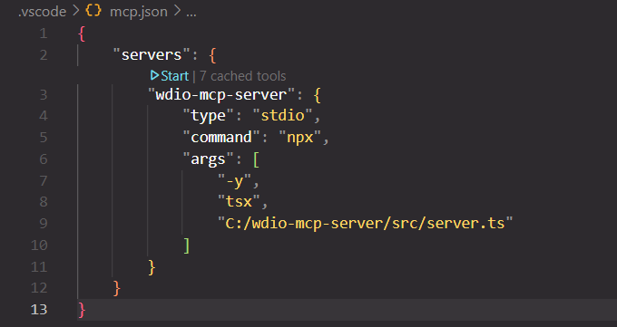
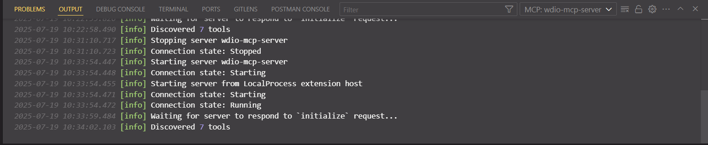

# wdio-mcp-server

A custom [Model Context Protocol (MCP)](https://modelcontextprotocol.org) server for automating WebdriverIO (WDIO) browser-based testing using GitHub Copilot Agent's **Agent Mode**. It enables LLM-powered QA automation: provide a test scenario in plain English, and the server performs testing **and** auto-generates WebdriverIO test code using the registered tools.

---

## 📦 What is MCP Server?

The MCP (Model Context Protocol) Server allows developers to expose tools that can be invoked by GitHub Copilot Agents through LLMs.  
This project extends MCP to support **WebdriverIO automation**, so your agent can:
- Interpret test scenarios
- Perform real-time UI testing
- Generate WDIO test automation code

---

## 🤖 Integration with GitHub Copilot Agent (Agent Mode)

Once configured, GitHub Copilot Agent (in **Agent Mode**) can:
- Communicate with this local MCP server
- Utilize WDIO-based tools to **run** and **generate** tests
- Dynamically interact with browsers using defined tools

---

## ⚙️ Local Setup Instructions

### 1. Clone and install dependencies

```bash
git clone https://github.com/your-username/wdio-mcp-server.git
cd wdio-mcp-server
npm install
```

### 2. Start the MCP Server

- Start the server by clicking the **Start** button on the `mcp.json` file in your IDE.
- 

### 3. Validate the server is running

- Ensure the server is running and all tools are available.
- 

### 4. Connect GitHub Copilot Agent with MCP Server

1. Launch **GitHub Copilot Agent**.
2. Go to ⚙️ **Settings** and enable **Agent Mode**.
3. (Optional) Disable the default LLM model if you prefer your own.
4. Click on **Configure Tools**.
5. **Select all the tools exposed by this project:**

   - `openBrowser`
   - `navigate`
   - `clickElement`
   - `setValue`
   - `getText`
   - `isDisplayed`
   - `closeBrowser`

---

You're now ready to test!  
Write your test scenarios in plain English and let the Copilot Agent automate your browser testing with WDIO.